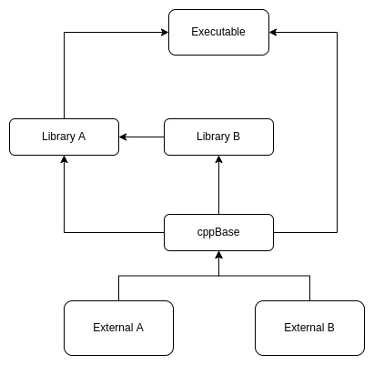

# Project Structure

## Basic Idea
My repository structure is designed to promote modularity and independence in my C++ project. 
The idea is to have every CMake target as its own separate module, with each module being its own repository. 
This allows for each repository to act as its own self-contained world, where changes and developments within one 
repository will not affect other repositories. This approach makes it easier to manage and maintain individual 
components of the project, and helps to reduce the risk of introducing bugs or breaking existing functionality. By 
using this modular approach, the project becomes more scalable, as new modules can be added or removed as needed, and 
existing modules can be updated and modified independently.

## Repository Structure
For repositories to be effectively managed, it's crucial to have a consistent structure that allows for easy 
organization and understanding by all team members and future contributors. A well-structured repository improves 
navigation, facilitates collaboration, and simplifies maintenance.  
I recommend structuring repositories with the following guidelines in mind:

- Essential directories such as source code, application files, and test cases should be consistently present in the repository.
- Other directories can be included as needed, depending on the specific requirements of the module.

By keeping the essential directories consistent and only adding additional directories as necessary, 
the repository can be [optimized for fetch performance](FetchOptimization.md) while still maintaining an organized structure.
I use the following structure:
- app/
- lib/
  - include/
  - src/
- test/
- CMakeLists.txt
- LICENSE

Having a consistent structure is important, even when multiple targets are housed in a single repository.
In these special cases, it's advisable to maintain the same base structure, with only the content of the "lib" directory 
changing to accommodate the different targets:

- app/
- lib/
  - libA/
    - include/
    - src/
  - libB/
    - include/
    - src/
  - CMakeLists.txt
- test/
- CMakeLists.txt
- LICENSE

## Biggest Disadvantage

One of the main challenges with this structure is maintaining consistency across all repositories, especially 
when it comes to cmake. To ensure that all repositories follow the same rules and guidelines, it's necessary to 
have a central repository that acts as a base for all other repositories. This central repository should handle things 
like setting warning flags, managing dependencies, and enforcing rules that apply to all repositories. By doing so, it 
helps to keep everything consistent and up-to-date, even as rules change and evolve over time, and dependencies 
are updated. This is what this repository is designed to do.  

## Basic example
For better understanding, let's take a look at a simple project example. Consider a scenario where we have an 
executable that requires library A. Library A, in turn, depends on library B and External A. Library B requires 
External A and External B. The project structure would look like this, where each rectangle represents a separate 
repository:

